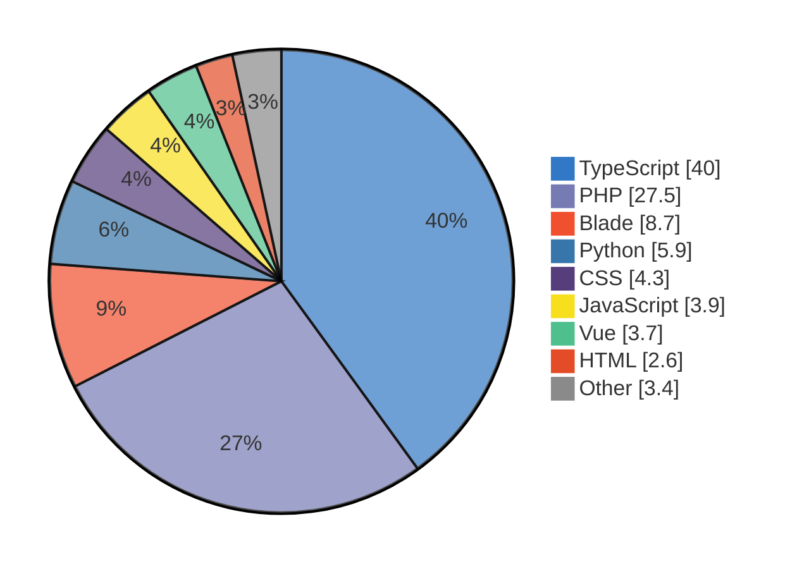

<h1 align="center">Welcome to bitwessel's GitHub&nbsp;👋</h1>

  <b>Wessel Willemsen</b> · Full-stack&nbsp;&amp;&nbsp;AI engineer · Amsterdam&nbsp;🇳🇱 
  Thriving on shipping product, and learning to architect it better.

  
  
  

  

---

> Welcome to my GitHub page, a diverse collection of the things I build.
> Sorry, not everything is public yet: I'm working on a lot that may go
> open source soon. Feel free to connect on **LinkedIn** (linked on my
> profile) and start a conversation. Thanks for stopping by! 🙌

## 🚀 What I do

- 🧱 **SaaS products**: full-stack apps from database to polished UI
- 🤖 **AI & RAG systems**: retrieval pipelines, agents, automation
- 🕷️ **Bots, scrapers & automation**: scripts that do the boring work for me
- 🌐 **Websites**: from marketing sites to dashboards
- 🎮 **Games & study projects**: the occasional small game and learning exercise
- 🏗️ **Architecture**: leveling up on system design, infra & clean foundations

## 🧰 Tech stack

**Languages**

  
  
  
  
  
  
  

**Frameworks & frontend**

  
  
  
  
  
  

**Infra, DevOps & testing**

  
  
  
  
  
  

## 📊 Languages across my repos

Measured by bytes across all of my repos. TypeScript leads because my biggest apps are TS; raw HTML/CSS look small because Vue, Astro and TSX keep markup and styles inside component files. (A generated Unity asset dump is excluded so the chart reflects what I actually write.)

## 🛹 Current project

If you'd like to check it out, here's what I'm building right now: **[amstaplan.nl](https://amstaplan.nl)**. Have fun! 😄

---

  
   
  <i>Building, breaking, and learning in public, one commit at a time.</i>

